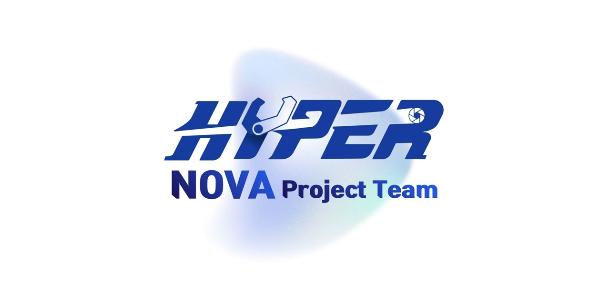

  
  
<strong>HYPERNOVA 로봇 프로젝트</strong>

## 프로젝트

HYPERNOVA는 스스로 움직이는 로봇을 직접 설계해서 만드는 팀 프로젝트입니다. 

## 다루는 영역

- 이동과 기체 제어
- 주변 인지와 위치 추정
- 자율 임무 수행과 상태 보고
- 시험, 관제, 시스템 레벨 통합

## 저장소 구조

| 경로 | 역할 |
| --- | --- |
| [`docs/`](./docs/) | 프로젝트 범위, 아키텍처, 개발·운용 지침, 결정 기록 |
| [`description/`](./description/) | URDF·Xacro, frame·joint와 실행에 필요한 mesh |
| [`firmware/`](./firmware/) | 보드별 펌웨어, 플래시 및 진단 도구 |
| [`ros_pkgs/`](./ros_pkgs/) | 기능별 ROS 2 package와 관제 애플리케이션 |
| [`sim_scenes/`](./sim_scenes/) | 시뮬레이션 환경과 검증 시나리오 |
| [`policies/`](./policies/) | 학습 기반 policy의 학습·평가·export 코드와 설정 |
| [`tools/`](./tools/) | 개발·검증·변환 도구 |

## 시작하기

1. [프로젝트 범위](./docs/project-scope.md) — 무엇이 정해졌고 무엇이 아직 비어 있는지
2. [`CONTRIBUTING.md`](./CONTRIBUTING.md) — Issue에서 시작해 branch, Pull Request로 가는 흐름
3. [저장소 정책](./docs/development/repository-policy.md) — 큰 파일이나 센서 데이터를 올리기 전에
4. [안전 지침](./docs/operations/safety.md) — 실물에 전원을 넣기 전에

## 문서

- [문서 색인](./docs/README.md)
- [ADR-0001: 단일 저장소로 시작](./docs/decisions/0001-monorepo-first.md)

## 라이선스

산출물 종류에 따라 라이선스가 다릅니다.

- 소프트웨어·펌웨어·시뮬레이션·학습·도구: Apache-2.0
- 기구·전자 설계와 그 파생 형상·제조 산출물: CERN-OHL-S-2.0
- 문서: CC BY 4.0
- HYPERNOVA 이름·로고·배너: 라이선스 대상 아님

적용 범위와 원문은 [`LICENSE.md`](./LICENSE.md)에 있습니다.
