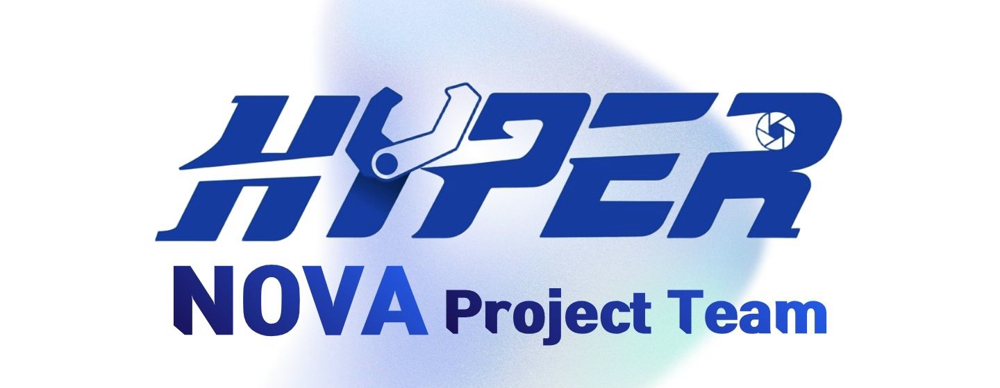

  
  
<strong>HYPERNOVA 로봇 프로젝트</strong>

## 프로젝트

HYPERNOVA는 자율로 이동하는 로봇을 직접 설계하고 만드는 팀 프로젝트입니다. 기체 형태, 센서 구성, 임무 시나리오는 아직 검토 중이고, 지금은 무엇을 만들지 정리하면서 작업 기준을 맞추는 단계입니다.

실행 가능한 로봇 소프트웨어는 아직 없습니다.

## 다루는 영역

- 이동과 기체 제어
- 주변 인지와 위치 추정
- 자율 임무 수행과 상태 보고
- 시험, 관제, 시스템 레벨 통합

## 저장소 구조

| 경로 | 역할 |
| --- | --- |
| [`docs/`](./docs/) | 프로젝트 범위, 아키텍처, 개발·운용 지침, 결정 기록 |
| [`hardware/`](./hardware/) | 기구·전자 원본, BOM, 제작 및 조립 자료 |
| [`firmware/`](./firmware/) | 보드별 펌웨어, 플래시 및 진단 도구 |
| [`software/`](./software/) | 온보드 소프트웨어, ROS 2 패키지, 관제 애플리케이션 |
| [`simulation/`](./simulation/) | 로봇 모델, 시뮬레이션 환경과 검증 시나리오 |
| [`tools/`](./tools/) | 개발·검증·변환 도구 |
| [`data/`](./data/) | 외부 데이터의 출처·라이선스·체크섬 기록 |

## 시작하기

1. [프로젝트 범위](./docs/project-scope.md)에서 지금 정해진 것과 열려 있는 것을 확인합니다.
2. [`CONTRIBUTING.md`](./CONTRIBUTING.md)에서 Issue → branch → Pull Request 흐름을 확인합니다.
3. 큰 파일이나 센서 데이터를 추가하기 전에 [저장소 정책](./docs/development/repository-policy.md)을 확인합니다.
4. 실물 장비를 다루기 전에 [안전 지침](./docs/operations/safety.md)을 확인합니다.

## 문서

- [문서 색인](./docs/README.md)
- [ADR-0001: 단일 저장소로 시작](./docs/decisions/0001-monorepo-first.md)

## 라이선스

이 저장소는 산출물 종류에 따라 여러 라이선스를 적용합니다.

- 소프트웨어·펌웨어·시뮬레이션·도구: Apache-2.0
- 하드웨어 설계: CERN-OHL-S-2.0
- 문서: CC BY 4.0
- HYPERNOVA 이름·로고·배너: 라이선스 대상에서 제외

적용 범위와 원문은 [`LICENSE.md`](./LICENSE.md)를 확인하세요.
